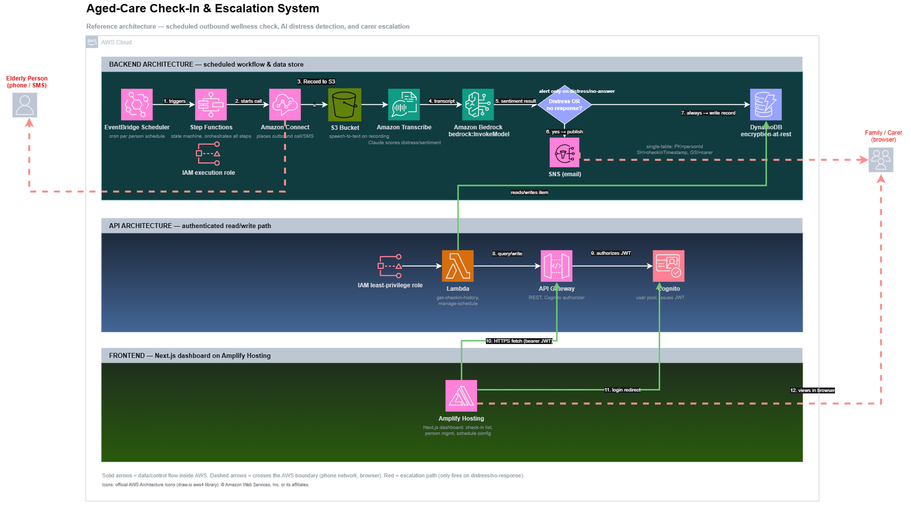

# Aged-Care Check-In & Escalation System

A scheduled, AI-analyzed wellbeing check-in system for elderly people, with
automatic family/carer alerting when something's wrong.

An elderly person receives a scheduled outbound call. Their response is
transcribed and analyzed for distress or non-response by Amazon Bedrock
(Claude). If something seems wrong — or they don't respond at all — their
family/carer is alerted by email. Every check-in is logged to a dashboard
the family can review.

Built as an AWS portfolio project — first of two, alongside an AI
Job-Match Engine — to demonstrate the AWS Cloud Practitioner and AI
Practitioner certifications with a real, non-generic, Well-Architected
system rather than a toy demo.

**Status:** Phase 0 (architecture) complete. AWS account and application
build not yet started. Full phase-by-phase plan and current progress:
[`docs/planning/DEVELOPMENT_PHASES.md`](docs/planning/DEVELOPMENT_PHASES.md).

## Architecture



```
EventBridge Scheduler (cron per elderly person)
  -> Step Functions state machine
       1. Amazon Connect places the outbound check-in call
       2. Contact Flow plays the prompt, records the response
       3. Amazon Transcribe converts the response to text
       4. Amazon Bedrock (Claude) scores sentiment / distress / responded
       5. Choice: no response or distress -> SNS email alert to carer
                  normal response -> log only
       6. Result written to DynamoDB
  -> Next.js dashboard (Cognito-gated) reads history via API Gateway + Lambda
```

Editable diagram source: [`docs/architecture/architecture-diagram.drawio`](docs/architecture/architecture-diagram.drawio).
Full locked design spec: [`docs/planning/specs/2026-08-25-aged-care-checkin-design.md`](docs/planning/specs/2026-08-25-aged-care-checkin-design.md).

## Tech stack

| Layer | Choice |
|---|---|
| Infrastructure as Code | AWS CDK (TypeScript) |
| Orchestration | AWS Step Functions |
| Outbound calling | Amazon Connect |
| Speech-to-text | Amazon Transcribe |
| AI analysis | Amazon Bedrock (Claude) |
| Alerting | Amazon SNS (email only) |
| Data store | Amazon DynamoDB (single-table design) |
| Compute | AWS Lambda |
| API | Amazon API Gateway |
| Auth | Amazon Cognito |
| Scheduling | Amazon EventBridge Scheduler |
| Frontend | Next.js, shadcn/ui (Radix + Tailwind) |
| Frontend hosting / CI-CD | AWS Amplify Hosting |
| Observability | Amazon CloudWatch (+ optional AWS X-Ray) |
| CI/CD (infra) | GitHub Actions |

Full service list with free-tier notes: see the design spec's
"AWS services used" table.

## Design system

Palette, typography, and the "vitals strip" signature UI element are
documented in [`docs/design/DESIGN_SYSTEM.md`](docs/design/DESIGN_SYSTEM.md).
All `web/` styling is driven from a single design-tokens file — no ad-hoc
values in components.

## Repository layout

```
├── CLAUDE.md           # project rulebook: process, git rules, cost rules
├── SOUL.md             # coding contract: how code gets written and reviewed
├── docs/
│   ├── architecture/    # AWS diagrams (.drawio source + PNG export)
│   ├── design/           # design tokens and system spec
│   ├── planning/          # phase plan + the locked design spec
│   └── decisions/          # ADRs (architecture decision records)
├── infra/               # AWS CDK app (not yet scaffolded — Phase 2)
└── web/                  # Next.js dashboard (not yet scaffolded — Phase 2)
```

## Development process

This project follows a deliberate, teaching-oriented build process — every
phase ends with a checkpoint before the next begins, AWS Console steps are
walked through by hand for hands-on learning, and every AWS service gets a
short introduction the first time it's used. See `CLAUDE.md` and `SOUL.md`
for the full rules.

## Author

Built by **Rafin** ([@Rafin31](https://github.com/Rafin31)) as a solo
portfolio project.
